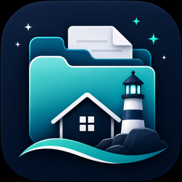

<div align="center">



# File Haven

A local-first desktop utility for finding clutter, duplicate files, large files, and old files without uploading your data.

[Download the latest release](../../releases/latest)

</div>

## First Launch Security Warning

File Haven is not currently signed with a paid Apple Developer or Windows code-signing certificate. Because of this, macOS or Windows may show a security warning the first time you open it.

### macOS

1. Try opening **File Haven.app** once.
2. Open **System Settings**.
3. Go to **Privacy & Security**.
4. Scroll down to the security message about File Haven.
5. Click **Open Anyway**.
6. Confirm by clicking **Open**.

Only bypass the warning when File Haven was downloaded from this official GitHub repository. Apple provides this override for apps from developers that macOS cannot verify.

### Windows

1. Extract the entire `File-Haven-Windows.zip` folder.
2. Double-click **File Haven.exe**.
3. If Windows displays **Windows protected your PC**, click **More info**.
4. Click **Run anyway**.

Windows may display this warning because the application is currently unsigned and has not established SmartScreen reputation.

File Haven runs locally and does not upload filenames, file contents, or scan results.

## Features

- Recursive folder scanning
- Responsive background processing
- Search by filename, folder, or extension
- Large-file filtering
- Old-file filtering
- SHA-256 duplicate detection
- Estimated reclaimable storage
- Persistent scan history with SQLite
- Sortable and multi-select file results
- Reveal files in Finder
- Safely move files to the system Trash
- Scan cancellation
- Empty states and error handling

## Download for macOS

Open the [latest GitHub release](../../releases/latest) and download either:

- `File-Haven-macOS.dmg` — recommended
- `File-Haven-macOS.zip` — portable alternative

### DMG installation

1. Download and open `File-Haven-macOS.dmg`.
2. Open `File Haven.app`.
3. Move the app to your Applications folder if desired.

### ZIP installation

1. Download `File-Haven-macOS.zip`.
2. Extract the ZIP file.
3. Open `File Haven.app`.

The current release is built for macOS. Windows and Linux users can run File Haven from source.

## Usage

1. Open File Haven.
2. Click **Choose Folder**.
3. Select a folder to analyze.
4. Click **Scan Folder**.
5. Browse or search the results.
6. Use the sidebar to view:
   - All Files
   - Duplicates
   - Large Files
   - Old Files
   - Scan History
7. Select files to reveal them or safely move them to Trash.

## Duplicate Detection

File Haven uses a two-step duplicate detection process:

1. Files are grouped by size.
2. Files with matching sizes are hashed using SHA-256.

Files are only marked as duplicates when their contents match. Similar filenames alone are not considered duplicates.

This approach avoids hashing files that cannot possibly be duplicates while still verifying matches accurately.

## Safety and Privacy

File Haven is designed around safe, local file management.

- Files are moved to the system Trash rather than permanently deleted.
- A confirmation dialog appears before files are moved.
- Failed operations are reported without stopping the entire cleanup.
- Duplicate files are verified by content.
- Scan results and file contents are never uploaded.
- All processing happens locally on the user’s computer.

## Technology

- Python
- PySide6
- SQLite
- SHA-256 hashing
- Send2Trash
- PyInstaller
- pytest
- Ruff

## Architecture

```text
src/file_haven/
├── domain/           # File, duplicate, and scan-history models
├── infrastructure/   # SQLite persistence
├── presentation/     # Windows, widgets, models, and workers
├── services/         # Scanning, duplicate detection, Trash, and file reveal
├── app.py            # Application entry point
├── constants.py      # Application settings
└── __init__.py
```

File Haven separates presentation, business logic, domain models, and persistence code.

Long-running tasks use Qt workers and background threads to keep the interface responsive. File results are displayed using `QTableView` with a custom model, allowing large folders to be handled efficiently without creating a widget for every table cell.

## Run from Source

### Requirements

- Python 3.13 or newer
- macOS, Windows, or Linux
- Git

Clone the repository:

```bash
git clone <REPOSITORY-URL>
cd file-haven
```

Create a virtual environment:

```bash
python3 -m venv .venv
```

Activate it on macOS or Linux:

```bash
source .venv/bin/activate
```

Activate it on Windows:

```powershell
.venv\Scripts\activate
```

Install File Haven:

```bash
python -m pip install -e .
```

Launch it:

```bash
file-haven
```

## Development

Format the project:

```bash
ruff format .
```

Run lint checks:

```bash
ruff check .
```

Run tests:

```bash
pytest
```

## Build the macOS App

Install PyInstaller:

```bash
python -m pip install pyinstaller
```

Build the application:

```bash
pyinstaller \
  --noconfirm \
  --clean \
  --windowed \
  --name "File Haven" \
  --icon "assets/FileHaven.icns" \
  --osx-bundle-identifier "com.savelmoshi.filehaven" \
  --paths "src" \
  --hidden-import "AppKit" \
  --hidden-import "Foundation" \
  "src/file_haven/app.py"
```

The packaged application will be created at:

```text
dist/File Haven.app
```

## Local Data

Scan history is stored locally at:

```text
~/.file_haven/file_haven.db
```

Removing this database clears the saved scan history but does not affect scanned files.

## License

This project is available for educational and portfolio use.
